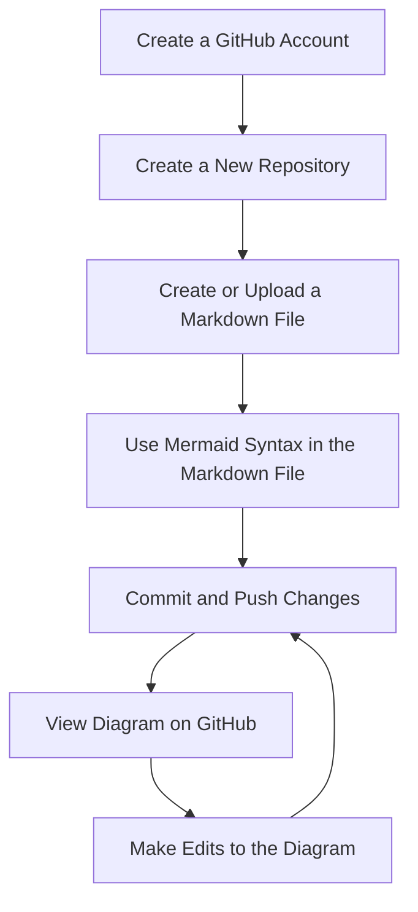

```mermaid
graph TD;
    A[Create a GitHub Account] --> B[Create a New Repository];
    B --> C[Create or Upload a Markdown File];
    C --> D[Use Mermaid Syntax in the Markdown File];
    D --> E[Commit and Push Changes];
    E --> F[View Diagram on GitHub];
    F --> G[Make Edits to the Diagram];
    G --> E;
```
