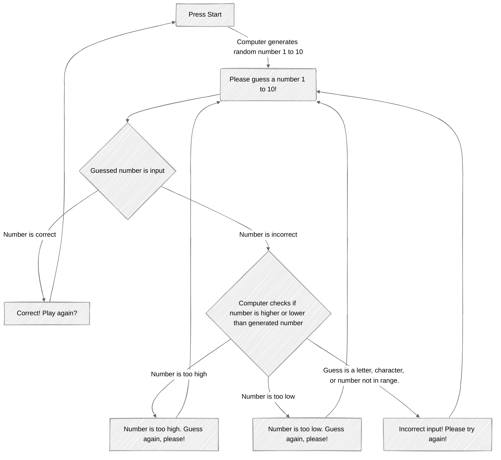

## Guessing Game
## This is a diagram of the flow of a guessing game.

```mermaid
---
config:
  look: handDrawn
  theme: neutral
---
flowchart TD
    %% This is the start of the game.
    A[Press Start] -->|Computer generates random number 1 to 10| B(Please guess a number 1 to 10!)
    %% The computer will generate a number to be guessed and prompt for a number to be guessed.
    B --> C{Guessed number is input}
    %% The player will guess a number and input it to see if it is correct.
    C -->|Number is correct| D[Correct! Play again?]
    %% The input number is correct and the player can choose to play again.
    C -->|Number is incorrect| E{Computer checks if number is higher or lower than generated number}
    %% The computer notifies that the guessed number is incorrect and prompts player to try again with another guess. 
    E -->|Number is too high| F[Number is too high. Guess again, please!]
    %% The number guessed was too high and the player needs to guess a lower number.
    E -->|Number is too low| G[Number is too low. Guess again, please!]
    %% The number guessed was too low and the player needs to guess a higher number.
    E -->|Guess is a letter, character, or number not in range.| H[Incorrect input! Please try again!]
    %% Input is not within parameters of game. Player needs to try again within parameters.
    F --> B 
    %% Player is sent back to guess screen to input new number.
    G --> B 
    %% Player is sent back to guess screen to input new number.
    H --> B 
    %% Player is sent back to guess screen to input new number.
    D --> A
    %% The player will need to guess a new number.
```    
